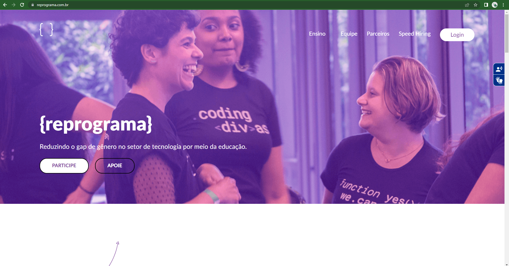

<h1 align="center">
  
</h1>

# Tema da Aula

Turma Online 18 - Todas em Tech  | Back-end | Semana 6 | 2022 | Professora Analu ✍(◔◡◔)

### Instruções
Antes de começar, vamos organizar nosso setup.
* Fork esse repositório 
* Clone o fork na sua máquina (Para isso basta abrir o seu terminal e digitar `git clone url-do-seu-repositorio-forkado`)
* Entre na pasta do seu repositório (Para isso basta abrir o seu terminal e digitar `cd nome-do-seu-repositorio-forkado`)
* Crie uma branch com seu nome (Para isso, basta abrir o seu terminal estando dentro do seu repositório e digitar `git checkout -b SEU-NOME-SOBRENOME`)


### Objetivo
Apresentar os conceitos de APIs e Web Apis. Introduzir os conceitos de desenvolvimento de back-end web

### Resumo
- [Tema da Aula](#tema-da-aula)
    - [Instruções](#instruções)
    - [Objetivo](#objetivo)
    - [Resumo](#resumo)

- [Conteúdo](#conteúdo)

  - [Como funciona a internet?](#como-funciona-a-internet)
    - [Modelo Server/Client](#modelo-serverclient)
    - [URI, URL, URN, Dominio, IP e DNS](#uri-url-urn-dominio-ip-e-dns)
    - [Protocolo HTTP e HTTPS](#protocolo-http-e-https)
    - [Request e Response](#request-e-response)

  - [API e API REST](#api-e-api-rest)
    - [Interface de Programação de Aplicativos](#interface-de-programação-de-aplicativos)
    - [Web APIs](#web-apis)
    - [Tipos de APIs](#tipos-de-apis)
    - [APIs REST e RESTfull](#apis-rest-e-restfull)
  - [JSON](#json)

  - [Exercícios](#exercícios)
  - [Material da aula](#material-da-aula)
  - [Links Úteis](#links-úteis)

# Conteúdo

## Como funciona a Internet?
O que acontece quando acessamos uma pagina na web? Vamos passar por esses pontos para entender pra onde vamos nesse próximo modulo, onde finalmente vamos começar a trabalhar com o backend.

Quando clicamos reprograma.com.br




#### Modelo Server/Client
A Web como conhecemos hoje tem uma arquitetura, ou seja, é construída dentro de um modelo **Servidor/Cliente** nele o processamento da informação é dividido em módulos ou processos distintos.

Claro que os sites não ficam dentro do nossos celulares e computadores, eles ficam dentro de computadores externos poderosos, os chamados servidores, e usamos os Clientes para acessa-los.

#### Cliente

Entenda cliente como a interface que o usuário interage, seja por computador, celular, tablet, smart TV, ou qualquer outro dispositivo que possa se conectar com a internet. É o Cliente que **solicita** serviços e informações de um ou mais servidores.

Algumas tarefas a serem realizadas pelo Cliente:

Gerenciando a interação com o usuário, o cliente esconde do usuário o servidor e a rede, caso houver. Para o usuário a impressão é que a aplicação está sendo rodada completamente local.

#### Servidor

E o Servidor é o responsável pelo processo, organização e gerenciamento das informações. É ele que **responde** às solicitações feitas pelo usuário. Ele é um processo reativo, disparado pela chegada de pedidos de seus clientes.


#### URI, URL, URN, Dominio, IP e DNS
Páginas web são escritas usando HTML (Hyper Text markup language) e cada uma tem um endereço, a URI. Ela representa um recurso específico na web. Recursos são coisas que eu quero interagir, como: imagens, páginas, arquivos, e videos.

Todo site tem um **domínio**, normalmente é por ele que acessamos e conhecemos o Site. Porém, no Server esse site não está registrado pelo nome de domínio, e sim pelo **endereço de IP**

Internet Protocol Address é o endereço exato de onde o site está dentro do servidor.

Então, antes de uma requisição ser feita o domínio deve virar o IP, e pra isso, usamos o **DNS**, o Domain Name System (Sistema de Nome de Domínio) que é como um grande dicionário de domínio para IP que já vem "de fábrica" no browser

Para entendermos uma URI precisamos entender a URL e a URN.

URL - Uniform Resource Locator (localizador de recurso uniforme). Ela representa o local/Host que estão localizados os recursos


URN – Uniform Resource Name (Nome de Recursos Universal). Ela representa um recurso específico na web que está sendo acessado.


URI – Uniform Resource Identifier (Identificador de Recursos Universal). É o identificador contendo que une o protocolo http + o localizador do recurso (URL) + nome do recurso (URN). Pode ser uma página html, imagem, vídeo ou qualquer outro arquivo web tem um endereço dentro da internet, esse endereço é a **URI**

As URIs tem um padrão que normalmente é composto por 4 partes:

> <protocolo>://<servidor>:<porta>/<recurso>
> 


#### Protocolo HTTP e HTTPS

Com o IP o browser pode localizar o Server e fazer uma requisição (Request) cheia de informações que deseja. 

Para enviar esse pedido, tanto o cliente quanto o servidor devem ¨falar a mesma lingua¨, e para isso foi criado o o HTTP (Hipertext Tranfer Protocol)

O Protocolo de Transferência de Hipertexto é um protocolo usado dentro do modelo Client/Server é baseado em pedidos (requests) e respostas (responses). Ele é a forma em que o Cliente e o Servidor se comunicam.


O protocolo HTTP define um conjunto de métodos de requisição responsáveis por indicar a ação a ser executada. Eles são chamados de **Verbos HTTP ou Métodos HTTP.**

Os verbos HTTP mais utilizados são:

- GET
- POST
- PUT
- PATCH
- DELETE

Dessa forma o Cliente manda um request solicitando um dos verbos e o servidor deve estar preparado para receber e responde-lo.


CRUD é a composição da primeira letra de 4 operações básicas de um banco de dados, e são o que a maioria das aplicação faz:

> ✅ **C:** Create (criar) - criar um novo registro
👁 **R:** Read (ler) - exibir as informações de um registro
♻️ **U:** Update (atualizar) - atualizar os dados do registro
❌ **D:** Delete (apagar) - apagar um registro
> 

É importante o entendimento desses conceitos pois com os verbos HTTP podemos executar o CRUD.


#### Request e Response

Quando o Client faz uma requisição o Servidor responde com um código de status numérico também padronizado.

Os códigos de status das respostas HTTP indicam se uma requisição HTTP foi corretamente concluída. As respostas são agrupadas em cinco classes:

> Respostas de informação (100-199)
Respostas de sucesso (200-299)
Redirecionamentos (300-399)
Erros do cliente (400-499)
Erros do servidor (500-599)
> 


Você pode ver todo os códigos e seus usos em: 

[HTTP Status Codes](https://httpstatuses.com/)

É a desenvolvedora Back end que coloca na construção do servidor quais serão as situações referentes a cada resposta.

O Client, ou browser recebe a resposta enviada pelo servidor. Isso em si, não faz com que algo apareça na tela do seu computador ou celular. 

O proximo passo é a resposta ser parseada! que é um estrangerismo que não tem uma tradução muito obvia em portugues, podemos chamar de análise sintática

Parse, dentro da ciencia da computação, é um termo usado para o processo de analise de uma sequencia de strings e a separação em componentes com seus respectivos tipos, pra que o computador ou o browser, no caso de aplicações front-end, possa interpretar corretamente os dados enviados.


## API e API REST
Application Programming Interface, em português **Interface de Programação de Aplicativos**, é um conceito um pouco abstrato, né? Uma Interface que nos possibilita Programar Aplicativos... Muitas vezes quando as pessoas desenvolvedoras falam em API elas estão se referindo a **Web APIs**, que é um pouco diferente. Quero que você entenda o que de fato é uma Interface de Programação de Aplicativos, para isso precisamos definir o que é uma **interface**.

#### Interface de Programação de Aplicativos
Preciso que você pense em um rádio.


Nós sabemos que ao aperta ou rodar um determinado botão podemos mudar de musica e até diminuir ou aumentar o volume certo? Porém nós não sabemos ao **como** isso está acontecendo. 

> Como ao rodar um botão do rádio pra um lado a musica aumenta e quando viramos para o lado contrario ela diminui?
> 

Não sabemos! E nem precisamo saber. O importante é que podemos usar mesmo não sabendo como de fato isso funciona internamente. 


A informação de como o rádio funciona foi **abstraída** para que possamos usar o aparelho, ou seja, a informação de como o rádio funciona foi isolada para que possamos usar somente a função final dos botões, mesmo que ambas estejam conectadas.

> A interface é uma forma de usarmos uma ferramenta sem precisar saber necessariamente o como.
> 

O mesmo acontece num aplicativo de ouvir música no celular. Nós sabemos que ao clickar num botão podemos parar ou começar uma música, porém não sabemos como isso de fato funciona.

Acredito que a desenvolvedora que fez esse aplicativo, quando estava criando essa função de parar e começar musicas, deve ter provavelmente usado uma função pronta da linguagem, como por exemplo a função onClick( ) do JavaScript.


A desenvolvedora não precisou criar do zero todas as linhas dessa função e não sabe de fato o que está acontecendo nela, ela já veio pronta na linguagem. 

Provavelmente, muitas outras pessoas desenvolvedoras tinham que criar essa função de click que dever ser trabalhosa, por isso, as pessoas que desenvolveram a linguagem resolveram colocar essa função lá, sem que as desenvolvedoras precisassem cria-la todas as vezes.

Foi criada um função pronta, **uma interface**, que facilita a programação de aplicativos.

Da mesma forma, acredito que a desenvolvedora não precisou programar a função que interage com o sistema operacional do celular (iOS ou Android) para ativar as saídas de sons dos aparelhos. A pessoa desenvolvedora provavelmente não sabe como de fato a musica começa tocar no aparelho, o próprio sistema operacional teve criar uma interface amigável para desenvolvedora de apps, ou seja, existe uma função já pronta para que a desenvolvedora só interaja com ela.

> Assim como no rádio, a API é uma interface que possibilita que usemos uma certa função, dado ou ferramenta sem precisar "reinventar a roda" na programação. 
Ela não necessariamente está num link na Web, ela pode ser uma lib, um framework, uma função já pronta em uma linguagem especifica, etc.
> 
#### Web APIs
Agora que sabemos o que é uma API fica mais fácil definir uma Web API.

Web API é uma interface que é disponibilizada de forma remota, pela web, que possibilita a programação aplicativos e softwares. 

Uma empresa de software lança sua API para o público de modo que outros criadores de software possam desenvolver produtos usando esse serviço ou dados. 

Alguns exemplos de Web APIs:

- API do Google Maps: onde não precisamos saber criar mapas navegaveis, só precisamos nos conectar a API que a própria google disponibiliza e ter os mapas criados pela Google dentro do nosso site.
- API do Correios: não precisamos criar um banco de dados com todos os CEPs do Brasil, o próprio correio disponibilizou uma API para que eu possamos utilizar e pesquisar os CEPs que desejamos e essa informação fica armazenada somente com eles.

#### Tipos de APIs

**Open APIs ou API Publicas**

São aquelas que são disponibilizadas gratuitamente para desenvolvedoras e usuários com restrição mínima. Podem precisar de cadastro, o uso de API Key ou ser completamente abertas.

Elas estão relacionadas com uso externo de dados ou serviços. 

**APIs Internas**

São o oposto das Api Publicas. Elas são seguras e escondidas de usuários externos. 

#### APIs REST e RESTfull
Representational State Transfer,

- INTERFACE UNIFORME: Uso correto dos verbos HTTP: GET, POST, PUT, DELETE, entre os demais verbos. Separação coesa dos recursos e de seus níveis.
- CLIENTE-SERVIDOR: Separação de responsabilidades entre Front-end e Backend-end.
- SEM ESTADO: Cada requisição que o cliente faz para o servidor, deverá conter todas as informações necessárias para o servidor entender e responder (RESPONSE) a requisição (REQUEST). Exemplo: A sessão do usuário deverá ser enviada em todas as requisições, para saber se aquele usuário está autenticado e apto a usar os serviços, e o servidor não pode lembrar que o cliente foi autenticado na requisição anterior. [retirado daqui](https://github.com/rocketseat-content/youtube-api-rest-restful)
- CACHEÁVEL: As respostas do servidor devem determinar se aquela informação pode entrar ou não em um cache. Assim o cliente pode confiar se aquela resposta pode ser usada novamente em uma requisição equivalente.
- CAMADA EM SISTEMAS: permite que uma arquitetura seja composta de camadas hierárquicas, restringindo o comportamento do componente de forma que cada componente não possa "ver" além da camada imediata com a qual está interagindo.
- Código sob demanda(opcional): Dá a possibilidade da nossa aplicação pegar códigos, como o javascript, por exemplo, e executar no cliente.

## JSON
#### O que é o JSON?
JSON significa **J**ava**S**cript **O**bject **N**otation - Notação de Objetos JavaScript. É uma formatação leve de troca de dados. Para seres humanos, é fácil de ler e escrever. Para máquinas, é fácil de interpretar e gerar. Está baseado em um subconjunto da linguagem de programação JavaScript, a pesar disso, JSON é em formato texto e completamente independente de linguagem, pois usa convenções que são familiares à maioria das linguagens atuais.

São dados salvos em um arquivo .json e consistem em uma lista com uma sequencia de pares chave / valor. Cujo formato se parece muito com o formato literal do objeto JavaScript.

```javascript
    { "key": "value" }
```
Você pode incluir os mesmos tipos de dados básicos dentro do JSON, como em um objeto JavaScript padrão — strings, números, matrizes, booleanos e outros literais de objeto. Porem, diferente das Arrays e Objetos os nomes das propriedades devem ser strings com aspas duplas e as vírgulas à direita são proibidas.

```javascript
    {
        "title": "Grave of the Fireflies",
        "description": "In the latter part of World War II, a boy and his sister, orphaned when their mother is killed in the firebombing of Tokyo, are left to survive on their own in what remains of civilian life in Japan. The plot follows this boy and his sister as they do their best to survive in the Japanese countryside, battling hunger, prejudice, and pride in their own quiet, personal battle."
      }
```

[JSON](https://www.json.org/json-pt)


***
### Exercícios 
* [Exercicio para sala](/exercicios/para-sala/)
* [Exercicio para casa](/exercicios/para-casa/)

### Material da aula 
* [Material](/material)

### Links Úteis
- **Artigo:** OLUWATOSIN, Haroon Shakirat. [Client-server model](https://www.researchgate.net/profile/Shakirat_Sulyman/publication/271295146_Client-Server_Model/links/5864e11308ae8fce490c1b01/Client-Server-Model.pdf). IOSR J Comput Eng (IOSR-JCE), v. 16, n. 1, p. 67, 2014.
-  **Site:** [ UFRGS - Conteúdo da matéria de Redes](http://www.penta.ufrgs.br/redes296/cliente_ser/cliente.htm)
- **PDF:** ([UFPE - Conteúdo da matéria de Desenvolvimento Web](https://cin.ufpe.br/~erp/DesenvWeb/aulas/http_servlet/http.pdf))
- **ArtigoÇ** 
(["HTTP: Desmistificando o protocolo da Web"](https://www.alura.com.br/artigos/desmistificando-o-protocolo-http-parte-1))
- **Site:** ([ MDN web docs - Métodos de requisição HTTP](https://developer.mozilla.org/pt-BR/docs/Web/HTTP/Methods))
- **Blog:**([ Angelo Públio - crud](https://angelopublio.com.br/blog/crud))
- **Site:** ([ MDN web docs - Códigos de status de respostas HTTP](https://developer.mozilla.org/pt-BR/docs/Web/HTTP/Status))
- **Video:** ([freeCodeCamp - APIs for Beginners - How to use an API](https://www.youtube.com/watch?v=GZvSYJDk-us))

Escrito por: Ana Luiza Sampaio para {Reprograma}

Me encontre no instagram: [@analu.io](https://www.instagram.com/analu.io)
ou me mande um e-mail: sampaioaanaluiza@gmail.com

<p align="center">
Desenvolvido com :purple_heart:  
</p>

